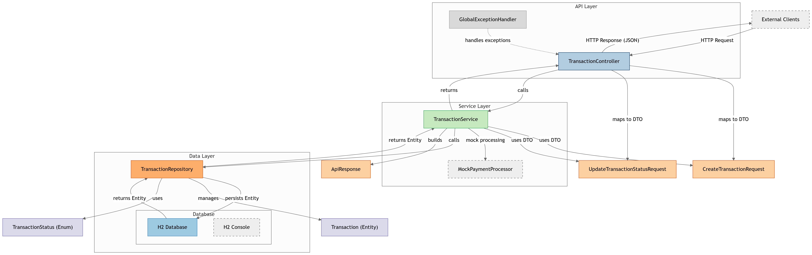

# Payment Transaction Service

## Overview

The Payment Transaction Service is a Spring Boot application designed to handle payment transactions using MongoDB as the database. It provides a RESTful API to create, retrieve, update, and delete transactions, with support for filtering by merchant, customer, status, and date range. The application supports both local MongoDB and MongoDB Atlas (free tier) for data storage and includes validation, error handling, and mock payment processing logic.

## Features

* Create new transactions with details such as merchant ID, customer ID, amount, currency, payment method, and description.
* Retrieve transactions by ID, merchant, customer, status, or date range.
* Calculate total transaction amounts for a merchant by status.
* Delete transactions.
* Input validation and comprehensive error handling.
* Pagination and sorting for transaction retrieval.
* H2 database console for development and testing.

## Technologies Used

* Java: 21
* Spring Boot: 3.2.0
* Spring Data MongoDB: For MongoDB operations
* MongoDB: Local or Atlas free tier for data storage
* Maven: Build tool
* Jakarta Validation: For input validation
* Jackson: For JSON serialization/deserialization

## Project Structure

payment-transaction-service/
├── pom.xml
├── src/
│   ├── main/
│   │   ├── java/com/example/payment/
│   │   │   ├── controller/
│   │   │   │   └── TransactionController.java
│   │   │   ├── dto/
│   │   │   │   ├── ApiResponse.java
│   │   │   │   ├── CreateTransactionRequest.java
│   │   │   │   └── UpdateTransactionStatusRequest.java
│   │   │   ├── exception/
│   │   │   │   └── GlobalExceptionHandler.java
│   │   │   ├── model/
│   │   │   │   ├── Transaction.java
│   │   │   │   └── TransactionStatus.java
│   │   │   ├── repository/
│   │   │   │   └── TransactionRepository.java
│   │   │   ├── service/
│   │   │   │   └── TransactionService.java
│   │   │   └── PaymentTransactionServiceApplication.java
│   │   └── resources/
│   │       └── application.properties
└── README.md

## Prerequisites

* Java 21: Ensure Java 21 is installed.
* Maven: Required for building the project.
* Git: For cloning the repository.
* MongoDB: Either a local MongoDB instance (version 4.4 or higher) or a MongoDB Atlas free tier account.

## Setup Instructions

### Option 1: Local MongoDB Setup 

Install MongoDB Locally:
* Download and install MongoDB Community Edition from MongoDB Download Center.
  
* Start the MongoDB server:
  
`mongod`

* Clone the Repository:

`git clone https://github.com/your-username/payment-transaction-service.git`
`cd payment-transaction-service`

* **Configure MongoDB:**

* Ensure the application.properties file is set for local MongoDB (default settings):
  `properties`
  
`spring.data.mongodb.host=localhost`
`spring.data.mongodb.port=27017`
`spring.data.mongodb.database=paymentdb`

* Build the Project:

bash : `mvn clean install`

* Run the Application:

`mvn spring-boot:run`

The application will start on `http://localhost:8080`.

* Access the H2 Console (for development):

** URL: `http://localhost:8080/h2-console`

### Option 2: MongoDB Atlas Free Tier Setup

* Create a MongoDB Atlas Account:
* Sign up at MongoDB Atlas.
* Create a free tier cluster and note the connection URI (format:
`mongodb+srv://<username>:<password>@<cluster>.mongodb.net/<database>)`.

## API Endpoints

The API is accessible at `/api/v1/transactions`. Below are the main endpoints:
* Create Transaction:
** `POST /api/v1/transactions`
** Body: `CreateTransactionRequest` (JSON)
** Example:

`{
  "merchantId": "merchant123",
  "customerId": "customer456",
  "amount": 100.00,
  "currency": "USD",
  "paymentMethod": "CREDIT_CARD",
  "description": "Test transaction"
}`
* Get Transaction by ID:
**`GET /api/v1/transactions/{id}`**
* Get All Transactions (with pagination and sorting):
**`GET /api/v1/transactions?page=0&size=10&sortBy=createdAt&sortDir=desc`**
* Get Transactions by Merchant:
**`GET /api/v1/transactions/merchant/{merchantId}`**
* Get Transactions by Customer:
**`GET /api/v1/transactions/customer/{customerId}`**
* Get Transactions by Status:
**`GET /api/v1/transactions/status/{status}`**

Valid statuses: **PENDING**, **PROCESSING**, **COMPLETED**, **FAILED**, **CANCELLED**, **REFUNDED**

* Update Transaction Status:
* `PUT /api/v1/transactions/{id}/status`
* Body: `UpdateTransactionStatusRequest` (JSON)
* Example:
`{
  "status": "COMPLETED"
}`
* Get Transactions by Date Range:
`GET /api/v1/transactions/date-range?startDate=2025-01-01T00:00:00&endDate=2025-12-31T23:59:59`
* Get Total Amount by Merchant and Status:
`GET /api/v1/transactions/merchant/{merchantId}/total?status=COMPLETED`
* Delete Transaction:
`DELETE /api/v1/transactions/{id}`

## Mock Payment Processing

The `TransactionService` includes a mock payment processing method (`mockPaymentProcessing`) that simulates payment processing with an 80% success rate, randomly setting the transaction status to **COMPLETED** or **FAILED**.

## Configuration

The `application.properties` file contains configurations for:

* Server port: `8080`
* MongoDB: Configurable for local (`localhost:27017`) or Atlas (URI-based connection)
*  Logging: Debug level for the application, info level for Spring web

## Testing

Run tests using:

`mvn test`

The project includes the `spring-boot-starter-test` dependency for unit and integration testing.

Note that tests may require a running MongoDB instance or a mock MongoDB setup (e.g., using `embedded-mongodb`).

## Contributing 

* Fork the repository.
* Create a new branch (git checkout -b feature/your-feature).
* Commit your changes (git commit -m "Add your feature").
* Push to the branch (git push origin feature/your-feature).
* Create a pull request.

## License

This project is licensed under the MIT License.
